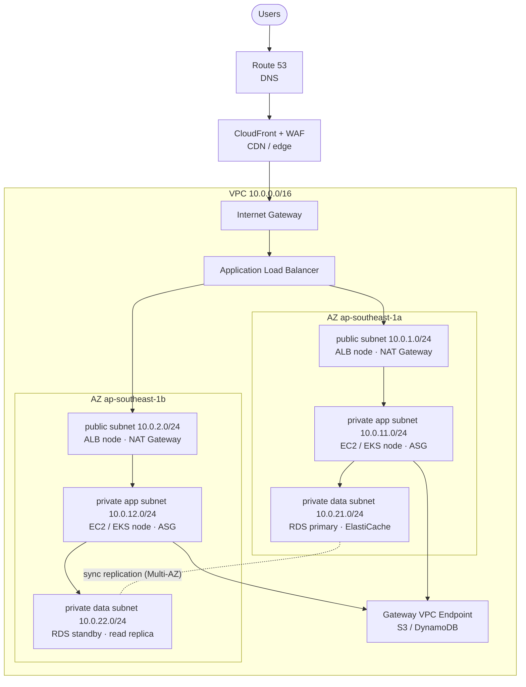

# AWS Architecture Cheat Sheet (SAA-C03)
 
สรุปสำหรับตัดสินใจเลือก service และอ่านโจทย์ข้อสอบ — [ตาราง keyword → คำตอบ](#keyword--คำตอบ-ตารางทำข้อสอบ) คือส่วนที่ใช้ทำข้อสอบได้เร็วที่สุด
 
## สารบัญ
 
- [Well-Architected Framework — 6 เสา](#well-architected-framework--6-เสา)
- [ขอบเขต Global / Regional / AZ](#ขอบเขต-global--regional--az)
- [สถาปัตยกรรม 3 ชั้นบน VPC (แบบอ้างอิง)](#สถาปัตยกรรม-3-ชั้นบน-vpc-แบบอ้างอิง)
- [เลือก Compute](#เลือก-compute)
- [เลือก Storage](#เลือก-storage)
- [S3 Storage Class](#s3-storage-class)
- [เลือก Database](#เลือก-database)
- [Load Balancer & การกระจาย Traffic](#load-balancer--การกระจาย-traffic)
- [Route 53 Routing Policy](#route-53-routing-policy)
- [Decoupling & Integration](#decoupling--integration)
- [Disaster Recovery — RTO / RPO](#disaster-recovery--rto--rpo)
- [Security ทุกชั้น](#security-ทุกชั้น)
- [Keyword → คำตอบ (ตารางทำข้อสอบ)](#keyword--คำตอบ-ตารางทำข้อสอบ)
- [กับดักที่เจอซ้ำ](#กับดักที่เจอซ้ำ)
---
 
## Well-Architected Framework — 6 เสา
 
| Pillar | ใจความ | Service ที่มักเป็นคำตอบ |
|---|---|---|
| **Operational Excellence** | รันและพัฒนา process ได้ต่อเนื่อง ทำ IaC และ automate | CloudFormation, CloudWatch, Systems Manager, CodePipeline |
| **Security** | least privilege, ป้องกันทุกชั้น, เข้ารหัสทั้ง in-transit และ at-rest, ตรวจสอบย้อนหลังได้ | IAM, KMS, WAF, Shield, GuardDuty, CloudTrail, Security Hub |
| **Reliability** | กระจายหลาย AZ, health check, auto recovery, ทดสอบ DR | Multi-AZ, ASG, ELB, Route 53 health check, S3 CRR |
| **Performance Efficiency** | เลือก resource ให้ตรงงาน, cache, ใช้ serverless เมื่อเหมาะ | CloudFront, ElastiCache, Global Accelerator, Lambda |
| **Cost Optimization** | จ่ายเท่าที่ใช้ เลือก pricing model ให้ตรง workload | Savings Plans, Spot, S3 Lifecycle / Intelligent-Tiering, Cost Explorer |
| **Sustainability** | ลดทรัพยากรที่ใช้ต่อหน่วยงาน — right-size, managed service, region ที่พลังงานสะอาด | Graviton, Auto Scaling, serverless |
 
---
 
## ขอบเขต Global / Regional / AZ
 
| Scope | Service | ผลต่อการออกแบบ |
|---|---|---|
| **Global** | IAM, Route 53, CloudFront, WAF (สำหรับ CloudFront), Organizations, Global Accelerator | ทำครั้งเดียวใช้ทุก region · ใบรับรอง ACM ของ CloudFront ต้องออกที่ **us-east-1** |
| **Regional** | S3 (bucket ผูก region), DynamoDB, SQS, Lambda, EKS, ELB, VPC | การข้าม region ต้องทำ replication เอง และมีค่า data transfer |
| **AZ** | EC2 instance, EBS volume, Subnet, RDS instance | **EBS ผูกกับ AZ เดียว** — ย้ายข้าม AZ ต้องผ่าน snapshot · EFS ใช้ได้หลาย AZ |
 
> :warning: เห็นคำว่า **"หลาย AZ"** → คิดถึง HA อัตโนมัติภายใน region (Multi-AZ RDS, ASG หลาย subnet)
> เห็น **"หลาย region"** → คิดถึง DR / latency ทั่วโลก (Route 53 latency routing, S3 CRR, DynamoDB Global Table, Aurora Global Database)
 
---
 
## สถาปัตยกรรม 3 ชั้นบน VPC (แบบอ้างอิง)
 

 
**กฎที่ต้องจำจากผังนี้**
 
- ทุกชั้นมีอย่างน้อย **2 AZ**
- ALB อยู่ public subnet เท่านั้น · app และ database อยู่ private เสมอ
- ออกเน็ตขาออกผ่าน **NAT Gateway** (ทำ 1 ตัวต่อ AZ ถ้าต้องการ HA จริง)
- คุยกับ S3/DynamoDB ผ่าน **Gateway VPC Endpoint** เพื่อไม่ต้องผ่าน NAT (ฟรี + ไม่มีค่า data processing)
---
 
## เลือก Compute
 
| โจทย์ | คำตอบ | เหตุผล |
|---|---|---|
| event สั้น ๆ, traffic ไม่สม่ำเสมอ, ไม่อยากดูแล server | **Lambda** | จ่ายตามการเรียก · timeout สูงสุด 15 นาที · memory ถึง 10 GB |
| container แต่ไม่อยากจัดการ node | **ECS/EKS on Fargate** | serverless container · คิดตาม vCPU/RAM ที่จอง |
| ต้องคุม kernel / daemonset / GPU หรือใช้ Kubernetes เต็มรูป | **EKS บน EC2 node group** | คุมได้ละเอียด แต่ต้องดูแล patch/scaling เอง |
| ยก app เดิมขึ้น cloud โดยไม่แก้โค้ด (lift & shift) | **EC2** | คุม OS ได้เต็มที่ |
| batch ที่ขัดจังหวะได้ ต้องการถูกที่สุด | **Spot Instance / Spot ใน ASG** | ถูกกว่า on-demand มาก · ถูกเรียกคืนได้ ต้องออกแบบให้ทนขัดจังหวะ |
| workload คงที่ 1–3 ปี | **Savings Plans / Reserved Instance** | ผูกมัดเพื่อลดราคา · Compute Savings Plans ยืดหยุ่นที่สุด |
| มี license ผูก host หรือ compliance ต้อง dedicated | **Dedicated Host** | ได้เครื่องจริงทั้งเครื่อง เห็น socket/core |
 
---
 
## เลือก Storage
 
| ต้องการ | เลือก | จุดที่ต้องจำ |
|---|---|---|
| object เก็บไฟล์ / static / backup / data lake | **S3** | durability 11 nines · ขยายไม่จำกัด · ไม่ใช่ file system |
| block disk ให้ EC2 หนึ่งเครื่อง | **EBS (gp3)** | ผูก 1 AZ · gp3 ปรับ IOPS แยกจากขนาดได้ · io2 สำหรับ DB ที่ต้อง IOPS สูง |
| disk ที่หลายเครื่อง/หลาย AZ เขียนร่วมกัน (Linux) | **EFS** | NFS, elastic, ข้าม AZ ได้ · แพงกว่า EBS |
| file share แบบ Windows / SMB / AD | **FSx for Windows** | FSx for Lustre = HPC ที่ต้อง throughput สูงมาก |
| temp disk เร็วสุด ยอมหายได้ | **Instance Store** | ephemeral — ข้อมูลหายเมื่อ stop/terminate |
| เชื่อม on-prem กับ cloud storage | **Storage Gateway** | File / Volume / Tape Gateway |
| ย้ายข้อมูลหลัก PB ขึ้น cloud | **Snowball / Snowmobile** | ถ้าโจทย์บอกว่า "ส่งผ่านเน็ตใช้เวลาหลายสัปดาห์" = ตอบ Snow family |
| ย้าย/sync ข้อมูลออนไลน์เป็นรอบ | **DataSync** | on-prem ↔ S3 / EFS / FSx |
 
---
 
## S3 Storage Class
 
| Class | ใช้เมื่อ | ค่า retrieve / ระยะเวลากู้ |
|---|---|---|
| `Standard` | เข้าถึงบ่อย | ไม่มีค่า retrieve |
| `Intelligent-Tiering` | ไม่รู้ pattern การเข้าถึง — ให้ AWS ย้ายชั้นเอง | มีค่า monitoring ต่อ object |
| `Standard-IA` | นาน ๆ เข้า แต่ต้องได้ทันที | มีค่า retrieve · min 30 วัน |
| `One Zone-IA` | สร้างใหม่ได้ถ้าหาย (เช่น thumbnail) | อยู่ AZ เดียว ถูกกว่าราว 20% |
| `Glacier Instant Retrieval` | archive ที่ยังต้องได้ทันที | มิลลิวินาที · min 90 วัน |
| `Glacier Flexible Retrieval` | archive ทั่วไป | 1–5 นาที (Expedited) ถึง 5–12 ชม. (Bulk) |
| `Glacier Deep Archive` | เก็บตามกฎหมาย 7–10 ปี ถูกสุด | 12–48 ชม. · min 180 วัน |
 
---
 
## เลือก Database
 
| โจทย์ | คำตอบ | จุดตัดสิน |
|---|---|---|
| relational, มี transaction, schema ชัด | **RDS** (MySQL/PostgreSQL/SQL Server/Oracle/MariaDB) | Multi-AZ = HA (sync, failover อัตโนมัติ) · Read Replica = scale read (async) |
| relational ที่ต้องการ performance/HA สูงกว่า RDS | **Aurora** | เก็บ 6 copy ใน 3 AZ · replica ได้ถึง 15 ตัว · Serverless v2 ปรับ capacity อัตโนมัติ |
| key-value, latency มิลลิวินาทีเดียว, scale ไม่จำกัด | **DynamoDB** | On-demand vs Provisioned + Auto Scaling · DAX = cache ระดับไมโครวินาที · Global Table = multi-region active-active |
| cache ลดภาระ DB / เก็บ session | **ElastiCache** | Redis = persistence, replica, sorted set · Memcached = simple, multi-thread |
| data warehouse ทำ analytics/BI | **Redshift** | columnar, OLAP · Spectrum query ตรงจาก S3 |
| query ไฟล์ใน S3 ตรง ๆ ด้วย SQL แบบ ad-hoc | **Athena** (+ Glue Catalog) | serverless จ่ายตามข้อมูลที่ scan (ใช้ Parquet + partition เพื่อลดเงิน) |
| full-text search / log analytics | **OpenSearch** | คู่กับ Kinesis/Firehose ในสาย observability |
| graph / ledger / time-series | **Neptune / QLDB / Timestream** | โจทย์มักบอกลักษณะข้อมูลมาตรง ๆ |
| ย้าย database ขึ้น cloud โดยมี downtime น้อย | **DMS** (+ SCT ถ้าเปลี่ยน engine) | SCT แปลง schema, DMS ย้ายข้อมูล + CDC |
 
---
 
## Load Balancer & การกระจาย Traffic
 
| Layer | เลือกเมื่อ | ความสามารถ |
|---|---|---|
| **ALB** — L7 | HTTP/HTTPS, microservice, container | path/host-based routing · target = IP/instance/Lambda · ต่อ WAF และ Cognito auth ได้ |
| **NLB** — L4 | TCP/UDP/TLS, ต้อง throughput สูง latency ต่ำ, ต้อง static IP | รับล้าน request/วินาที · ได้ Elastic IP ต่อ AZ · ใช้กับ PrivateLink |
| **GWLB** — L3 | ส่ง traffic ผ่าน firewall/IDS ของ third-party | GENEVE protocol · security appliance แบบ transparent |
| **CloudFront** | ลด latency ผู้ใช้ทั่วโลก, cache static, ป้องกัน DDoS | edge location · OAC ให้เข้า S3 ได้แบบไม่ต้อง public · signed URL/cookie |
| **Global Accelerator** | ต้องการ anycast static IP และ failover ข้าม region สำหรับ TCP/UDP (non-HTTP) | วิ่งบน AWS backbone · **ไม่ cache** (ต่างจาก CloudFront) |
 
---
 
## Route 53 Routing Policy
 
| Policy | ใช้เมื่อ |
|---|---|
| `Simple` | record เดียว ไม่มี health check |
| `Weighted` | แบ่ง % traffic — ทำ canary / blue-green |
| `Latency` | ส่งไป region ที่ตอบเร็วที่สุดสำหรับผู้ใช้คนนั้น |
| `Failover` | active-passive DR ใช้ health check ตัดสิน |
| `Geolocation` / `Geoproximity` | บังคับตามประเทศผู้ใช้ (data sovereignty) / ปรับ bias ตามระยะ |
| `Multivalue` | คืนหลาย IP พร้อม health check — poor-man's load balancing |
 
---
 
## Decoupling & Integration
 
| Service | รูปแบบ | ใช้เมื่อ |
|---|---|---|
| **SQS** | queue, 1 ผู้ส่ง → 1 ผู้รับ, pull | buffer งานไม่ให้หาย, ตัด coupling, ให้ ASG scale ตามความยาวคิว · FIFO เมื่อลำดับสำคัญ · DLQ เก็บ message ที่ประมวลผลไม่สำเร็จ |
| **SNS** | pub/sub fan-out, push | หนึ่ง event ส่งหลายปลายทาง · ท่ามาตรฐาน: **SNS → SQS หลายคิว** |
| **EventBridge** | event bus + rule + schedule | กรอง event ตาม pattern, ต่อ SaaS/service ของ AWS, cron แทน CloudWatch Events |
| **Step Functions** | state machine | workflow หลายขั้นที่ต้อง retry / รอ / แตกเป็นสาขา — แทนการให้ Lambda เรียกกันเอง |
| **Kinesis Data Streams** | streaming ที่ต้องเรียงและอ่านซ้ำได้ | real-time, หลาย consumer, เก็บ record ได้ถึง 365 วัน |
| **Data Firehose** | ส่ง stream เข้าที่เก็บ | near-real-time → S3/Redshift/OpenSearch, แปลงร่างได้, ไม่ต้องเขียน consumer |
| **API Gateway** | ทางเข้า API | throttling, caching, auth (Cognito / Lambda authorizer), ต่อ Lambda/HTTP/AWS service |
 
> :warning: **อ่านโจทย์**
> - "ผู้ใช้กดแล้วไม่ควรรอ / งานพีคเป็นช่วง / ข้อความต้องไม่หาย" → **SQS**
> - "ส่ง event เดียวไปหลายระบบ" → **SNS** (หรือ SNS + SQS)
> - "ต้องเรียงลำดับและอ่านย้อนได้" → **Kinesis**
> - "หลายขั้นตอนมีเงื่อนไขและ retry" → **Step Functions**
 
---
 
## Disaster Recovery — RTO / RPO
 
| กลยุทธ์ | RTO / RPO | ค่าใช้จ่าย | ลักษณะ |
|---|---|---|---|
| **Backup & Restore** | ชั่วโมง–วัน | ต่ำสุด | snapshot/backup ข้าม region แล้วค่อยสร้างใหม่เมื่อเกิดเหตุ |
| **Pilot Light** | สิบนาที–ชั่วโมง | ต่ำ | เปิดแค่แกนหลักไว้ (database replica) ส่วน compute ปิดรอ |
| **Warm Standby** | นาที | กลาง | ระบบครบแต่ scale เล็ก พร้อมขยายเมื่อ failover |
| **Multi-Site Active/Active** | ใกล้ศูนย์ | สูงสุด | รับ traffic ทั้งสองฝั่ง (Route 53 + DynamoDB Global Table / Aurora Global) |
 
> :bulb: **แยกให้ชัด**
> **RTO** = ยอมหยุดให้บริการได้นานเท่าไร (เวลากู้คืน) · **RPO** = ยอมเสียข้อมูลย้อนหลังได้เท่าไร (ความถี่ backup/replication)
> โจทย์จะให้ตัวเลขมาแล้วให้เลือกกลยุทธ์ที่ **ถูกที่สุดที่ยังผ่านเกณฑ์**
 
---
 
## Security ทุกชั้น
 
| ชั้น | เครื่องมือ | ใช้ทำอะไร |
|---|---|---|
| Identity | IAM, IAM Identity Center, Cognito | IAM Role สำหรับ workload · Identity Center สำหรับพนักงาน multi-account · Cognito สำหรับผู้ใช้ของแอป |
| Guardrail องค์กร | Organizations, SCP, Control Tower | SCP เป็นเพดานสิทธิ์สูงสุด ไม่ได้ให้สิทธิ์ · Control Tower วาง landing zone ให้ |
| Network | SG, NACL, WAF, Shield, Network Firewall | SG = stateful ระดับ ENI · NACL = stateless ระดับ subnet · WAF กัน SQLi/XSS ที่ L7 · Shield Advanced กัน DDoS ใหญ่ |
| Data | KMS, CloudHSM, ACM, Macie | KMS จัดการคีย์ (rotate ได้) · CloudHSM เมื่อต้องคุมคีย์เองตาม compliance · Macie หา PII ใน S3 |
| Detect | CloudTrail, Config, GuardDuty, Inspector, Security Hub | CloudTrail = ใครทำอะไร · Config = ทรัพยากรเปลี่ยนไปจาก baseline ไหม · GuardDuty = ตรวจจับพฤติกรรมผิดปกติ · Inspector = สแกนช่องโหว่ EC2/ECR/Lambda |
 
---
 
## Keyword → คำตอบ (ตารางทำข้อสอบ)
 
| คำในโจทย์ (EN) | ให้มองหา |
|---|---|
| highly available / fault tolerant | หลาย AZ, ASG, ELB, Multi-AZ RDS — ตัดตัวเลือกที่อยู่ AZ เดียวออกทันที |
| most cost-effective / minimize cost | Serverless, Spot, S3 Lifecycle / Intelligent-Tiering, Savings Plans, ปิดของที่ไม่ใช้ |
| minimize operational overhead / fully managed | Lambda, Fargate, Aurora Serverless, DynamoDB, SQS — เลี่ยงคำตอบที่ต้องดูแล EC2 เอง |
| decouple | SQS, SNS, EventBridge |
| real-time / streaming / ordered | Kinesis Data Streams (Firehose ถ้าโจทย์บอก near-real-time และปลายทางเป็น S3/Redshift) |
| global users / reduce latency worldwide | CloudFront (HTTP, cache), Global Accelerator (TCP/UDP, static IP), Route 53 latency routing |
| single-digit millisecond | DynamoDB (ถ้าพูดถึง microsecond = DynamoDB + DAX) |
| without internet / stay on AWS network | VPC Endpoint (Gateway สำหรับ S3/DynamoDB), PrivateLink |
| no inbound ports / no bastion / no SSH key | Systems Manager Session Manager |
| automatically rotate credentials | Secrets Manager |
| who made this API call / audit | CloudTrail |
| configuration change / compliance drift | AWS Config |
| encrypt at rest with own key control | KMS (CloudHSM ถ้าโจทย์ย้ำว่าต้องคุม hardware / single-tenant) |
| shared file system across instances | EFS (Windows/SMB = FSx for Windows) |
| sudden unpredictable spikes | Auto Scaling, DynamoDB On-demand, Lambda |
| long-term archive / regulatory 7 years | S3 Glacier Deep Archive (+ Object Lock ถ้าพูดถึง WORM/immutable) |
| migrate petabytes / limited bandwidth | Snowball / Snowmobile |
| lift and shift quickly | EC2, Application Migration Service |
| protect against SQL injection / XSS | AWS WAF |
| DDoS protection with 24/7 support | Shield Advanced |
| detect malicious behavior / compromised instance | GuardDuty |
| find PII in S3 | Macie |
| query data in S3 with SQL, no infrastructure | Athena |
| data warehouse / complex BI joins | Redshift |
| hybrid / consistent low latency to on-prem | Direct Connect (Site-to-Site VPN ถ้าโจทย์ต้องการเร็วและถูก หรือเป็น backup ของ DX) |
| many VPCs need to connect | Transit Gateway (peering ถ้ามีแค่ 2 VPC) |
| static website | S3 + CloudFront (+ OAC, ACM ที่ us-east-1) |
| session state for stateless app | ElastiCache Redis หรือ DynamoDB |
 
---
 
## กับดักที่เจอซ้ำ
 
### IAM
ลำดับการตัดสิน: **Explicit Deny > Explicit Allow > Implicit Deny** — ถ้ามี Deny ที่ใดที่หนึ่ง (identity policy, resource policy, SCP, permission boundary) ก็จบ · IAM เป็น **Global** · Group ซ้อน Group ไม่ได้ · Group ไม่มี ARN ที่ assume ได้
 
### SCP
SCP **ไม่เคยให้สิทธิ์** มันแค่จำกัดเพดาน — ต้องมี IAM policy ให้สิทธิ์จริงด้วย · SCP ไม่มีผลกับ management account
 
| Pattern | วิธีทำ | ลักษณะ |
|---|---|---|
| Deny List (ค่าเริ่มต้น) | คง `FullAWSAccess` ไว้ แล้วเพิ่ม SCP ที่ Deny เฉพาะที่ห้าม | ดูแลง่าย ยืดหยุ่น |
| Allow List | ถอด `FullAWSAccess` ออก แล้ว Allow เฉพาะที่อนุญาต | เข้มกว่า แต่ดูแลยาก ต้องตามเพิ่ม service ใหม่เรื่อย ๆ |
 
### Multi-AZ vs Read Replica
RDS **Multi-AZ** = sync, standby ไม่รับ read, มีเพื่อ **HA** · **Read Replica** = async, รับ read ได้, มีเพื่อ **performance** (ทำข้าม region ได้และใช้เป็น DR ได้)
→ โจทย์ที่ถามเรื่อง "แบ่งเบาภาระ report/analytics" ตอบ **Read Replica** ไม่ใช่ Multi-AZ
 
### SG vs NACL
 
| | Security Group | Network ACL |
|---|---|---|
| ระดับ | ENI / instance | subnet |
| state | **stateful** (ขาเข้าอนุญาตแล้วขากลับผ่านเอง) | **stateless** (ต้องเปิด ephemeral port 1024–65535 ขากลับ) |
| rule | มีแต่ Allow | มีทั้ง Allow และ **Deny** |
| ลำดับ | ประเมินทุก rule รวมกัน | ตามเลข rule จากน้อยไปมาก |
 
→ โจทย์ที่ต้อง "บล็อก IP เดียว" ต้องใช้ **NACL** เพราะ SG ไม่มี Deny
 
### ACM / CloudFront
certificate สำหรับ **CloudFront ต้องออกที่ us-east-1** เท่านั้น · สำหรับ ALB ให้ออกที่ region เดียวกับ ALB
 
### S3
Bucket name เป็น **global unique** แต่ข้อมูลอยู่ใน region ที่สร้าง · เปิด versioning แล้ว **ปิดกลับไม่ได้** ทำได้แค่ suspend · Cross-Region Replication ต้องเปิด versioning ทั้งสองฝั่ง และไม่ replicate ของเก่าย้อนหลัง (ต้องใช้ Batch Replication)
 
### EBS
EBS ผูก **AZ เดียว** — ย้ายข้าม AZ/region ต้อง snapshot แล้วสร้างใหม่ · gp3 แยก IOPS ออกจากขนาด volume (ไม่ต้องขยาย disk เพื่อขอ IOPS เหมือน gp2) · io2 Block Express สำหรับ IOPS สูงสุด
 
### NAT Gateway
อยู่ใน **public subnet** แต่ให้บริการ private subnet · ตัวเดียว = single point of failure ต่อ AZ ต้องทำ 1 ตัวต่อ AZ ถ้าต้องการ HA · เป็นตัวสร้างค่า data processing ที่คนลืม — ถ้า traffic วิ่งไป S3/DynamoDB ให้ใช้ **Gateway Endpoint (ฟรี)** แทน
 
---
 
[← กลับหน้าสารบัญ](./README.md)
